# Milestone Project 3

---

## Fast & Furious RC Car Club

### 👉 [Heroku App](https://ffrccc-project.herokuapp.com/)

This Milestone project is a summary of learning and study from all modules of the Full Stack Developer Course, culminating in the creation of this Full Stack Framework Django project.

FFRCCC is a radio controlled car club. There are a number of users that the website will target and each of these user types will have a different need when using the website.

## Table of contents

- <a href="#project">Project Construction 👷</a>
- <a href="#ux">User Experience Design 🧠</a>
    - <a href="#us">User Stories</a>
    - <a href="#us">Design</a>
- <a href="#features">Features List 😲</a>
  - <a href="#existing">Existing Features</a>
  - <a href="#future">Future Features</a>

## 1️⃣ Project Construction 👷

The application uses Django 3 which is one of the most popular development tools. The project uses Separation of Concern amongst the applications to utilise the Django Framework effectively.

In addition to using Django, sqlite was used in the early stages of the project as a test database for local testing. Sqlite is an independent, highly reliable SQL database engine that supports all normal relational database management functions. Before deployment, I switched to Postgres witch is open source software that provides a fully technical and easy-to-use object-oriented relational database management system.

Thanks to Django, the application administrator has full access to a completely custom admin dashboard where he can create, read, update and delete records in any proposed application model as needed.

For the testing of the store and subscriptions, a test credit card can be used by inputting the following details:
- Card Number: 4242 4242 4242 4242
- Exp date: 04/24
- CVC: 424
- ZIP: 42424

<a href="#top">Back to top ⬆️</a>

## 2️⃣ User Experience Design 🧠

### User stories:

#### Guest (un-registered) User:

- As a Guest user, I want to view information about the club.
- As a Guest user, I want to see club contact informations.
- As a Guest user, I want to read the latest news about the club.
- As a Guest user, I want to read about benefits of membership.
- As a Guest user, I want to view all products in the shop.
- As a Guest User, I want to search for an item in the shop.
- As a Guest user, I want to sort prducts by price, name and category.
- As a Guest user, I want to see products within selected category.
- As a Guest User, I want to see detailed view of an item.
- As a Guest User, I want to be able to add items into the bag.
- As a Guest User, I want to be able to manipulate a bag content.
- As a Guest User, I want to see total count of the basket on every page.
- As a Guest User, I want to know how Grand Total was calculated.
- As a Guest User, I want easily fill out delivery information.
- As a Guest User, I want to view an order summary once a purchase is made.
- As a Guest User, I want to recieve an email confirmation when a purchase is made.
- As a Guest User, I want to be able to register for an account.
- As a Guest user, I want to be able to view the site on any device I may have.
- As a Guest user, I want app to be visually appealing and easy in use.

#### Registered User:

- As a Registered User, I want to have the ability to Login to the site via my registered details.
- As a Registered User, I want to be able to recover my account password.
- As a Registered User, I want to be able to comment under individual club news.
- As a Registered User, I want to be able to purchase club membership.
- As a Registered User, I want to have a profile page where I can see my details.
- As a Registered User, I want to have a profile page where I can see my purchase history.
- As a Registered User, I want to write a products reviews.

#### Superuser:

- As a Superuser, I want to add, edit and delete news.
- As a Superuser, I want to delete comments under individual news.#
- As a Superuser, I want to add, edit and delete products in shop.
- As a Superuser, I want to delete products reviews.

#### Administrator:

- As an Administrator, I want to be able to login to an administration panel.

### Design:

#### Color Scheme:

The main three colors in the app:

-  #007A47 used as a background for navbar

-  #198754 bootstrap "success" color used to higlight text and for buttons

-  #1F2A34 used as footer background

#### Typography:

The "Lato" font is the main font used throughout the whole website with Sans Serif as the fall back font in case the font isn't imported into the site correctly.
Lato offers a pleasing reading ability to the user and is easy on the eyes. Font is  clean, professional and very readable amongst all major languages.

#### Content Structure:

The application is primarily rectangular shaped. Buttons, cards have sharp edges to create consistent view for the user. Content is grouped in sections, an example of this would be the Home page:
- The main body of the page is horizontally separated into sections, we have a hero section, about section where user can read  about the club, and finally we have membership section where are informations about membership. Page is finished by footer where user can find quick site links, club address, email address and social links.

#### Wireframes:

The first raw design wos drawn on a piece of paper and then the idea was transferred to an advanced creator.

##################################################################################################################

<a href="#top">Back to top ⬆️</a>

## 4️⃣ Features List 😲

### Existing features:

This application has different features for different user types. User status determines what kind of functions a given user has:
- Guest - unregistered / not logged in user.
- User - registered in database and logged in to application.
- Superuser - User with higher level of permissions. The Superuser can add, edit, delete news and shop products from the application level. He also ensures that comments and reviews does not break ethical rules.
- Admin - has the highest level of permissions and can login to admin panel.

#### Navigation:

The navbar serves as the main navigation for the site. It has bootstrap class="sticky" so it's always visible at the top of the page accross all pages of the site. The navbar has four links, which go to the home page, the news page, the the memberships page and shop.

The top header shows links to login and register and basket which is the link to the basket page and also to keep track of the ammount of the current basket.

Bottom header contains FFRCCC club logo, which links to the homepage.

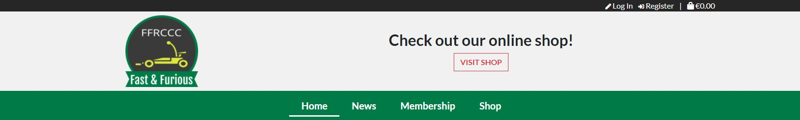

While user is logged in, instead of login and register links, he can see a 'My account' dropdown with options to go to the profile page or logout.

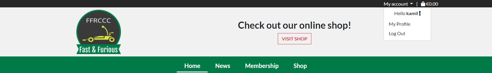

#### Footer:

The footer serves as secondary navigation. It has the same links as the navbar and also features the car club address and some external links to facebook, twitter and youtube.

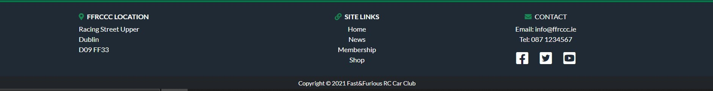

#### Home:

The home page is the landing page upon sign-up and login and the main hub for the app. The main features on this site is the hero image and a statement in header to say to check the online shop.

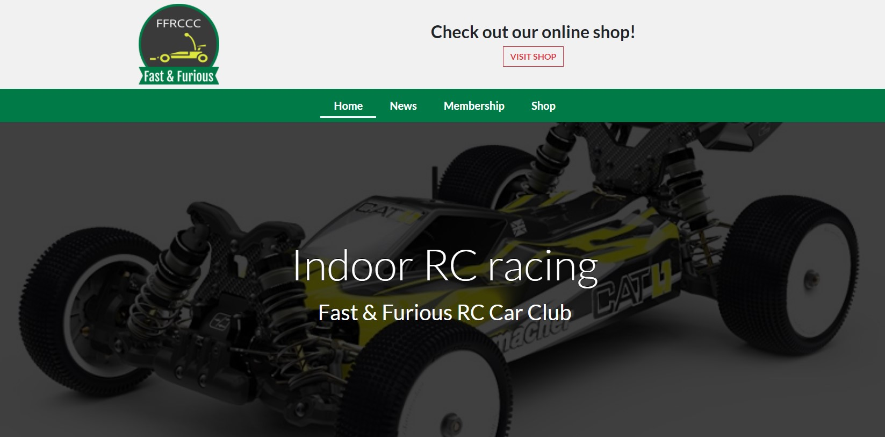

Beneath all this there are about section where user can find info about club

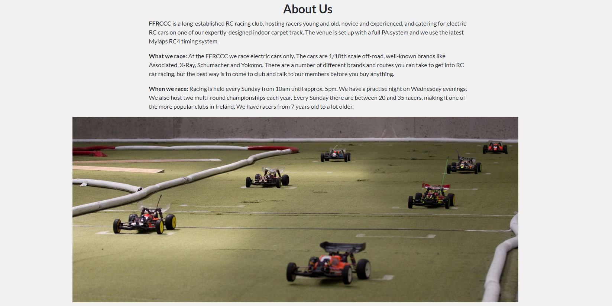

and membership section where user can find membership info and redirection button to membership page.

#### News:

The news page serves as a place listing all of the news posts one page. The news are stacked in a single column vertically down the page on all screen sizes. Each news post shows the title, date of post, the author, the first 200 characters of introduction. By clicking on title user will be redirected to post view page.

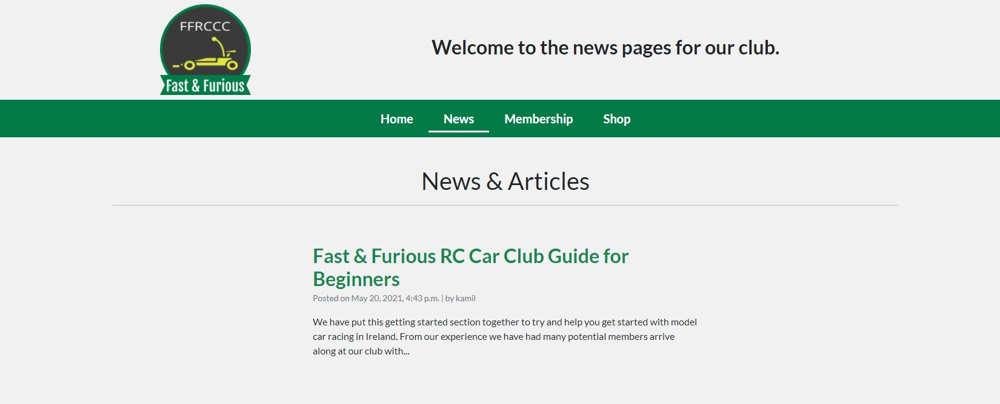

Superuser can also add, edit and delete a post from this page.

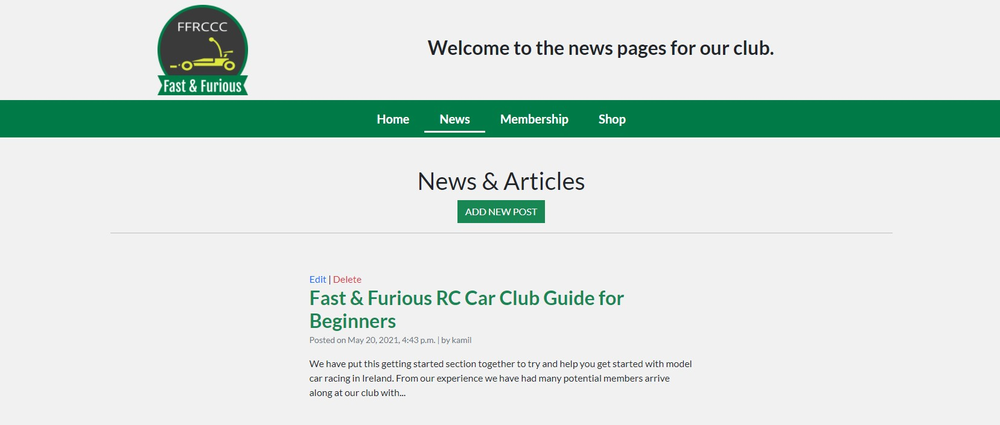

While adding post, Superuser can use HTML language to style post content.

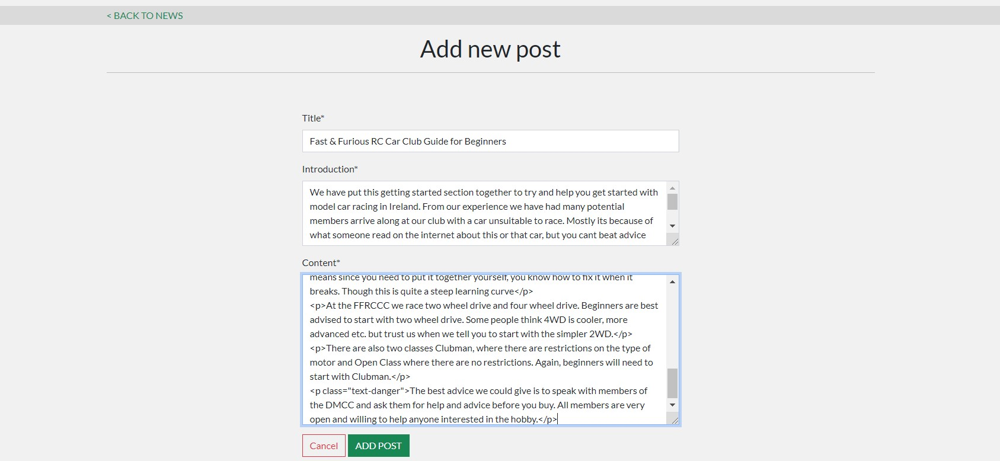

#### Post view

The post page shows the full details of the individual news. On the top users can see handy web navigation to back to all news.

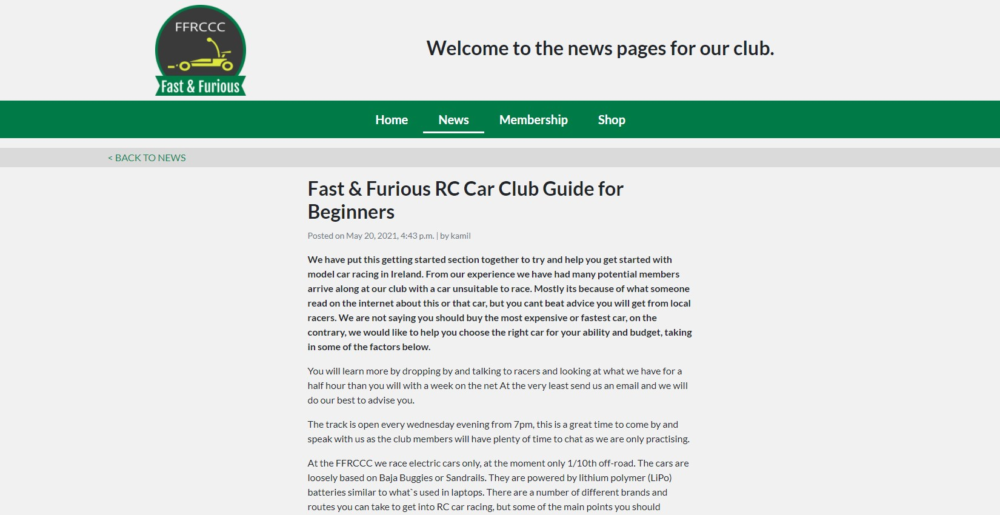

Underneath the post, there is an option to leave a comment about post. However Guest users are limited to view the comments only.

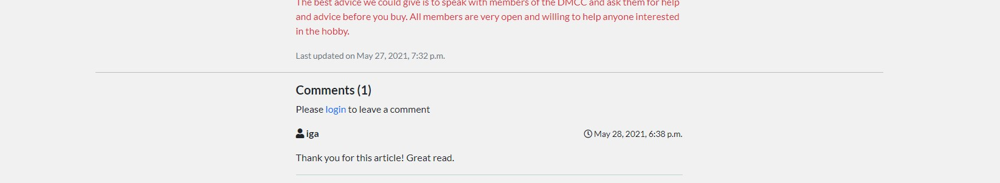

User will only be able to leave a comment if he is logged in.

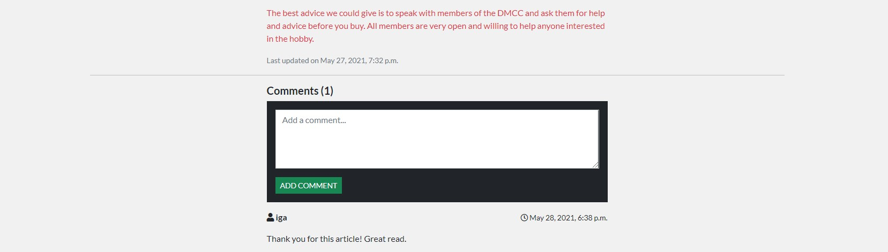

Superuser can delete any comment.

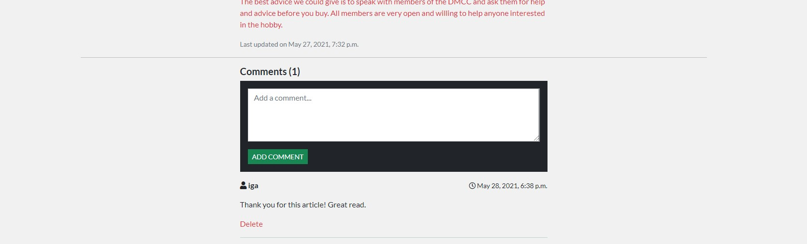

#### Membership

The memberships page serves as the page to buy club membership. First two paragraphs are to explain membership conditions. On the bottom of the page - membership card is displayed.

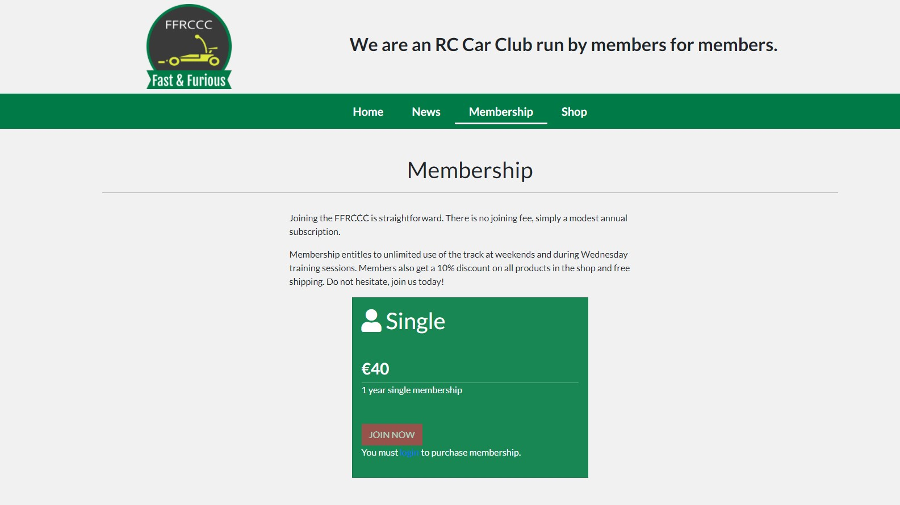

The content of membership card is dependent on the current membership of the user. Guest user will see membership card however 'Join' button will be disabled and 'You must login to purchase membership' text will be displayed.

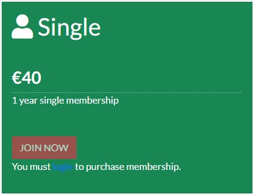

Logged in user will see card with active button.

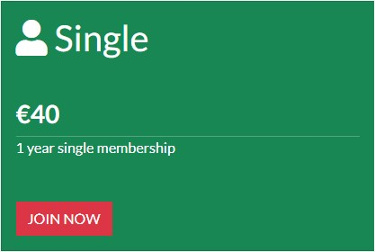

Button click will take them to the stripe checkout page where they would add their card details and become member.

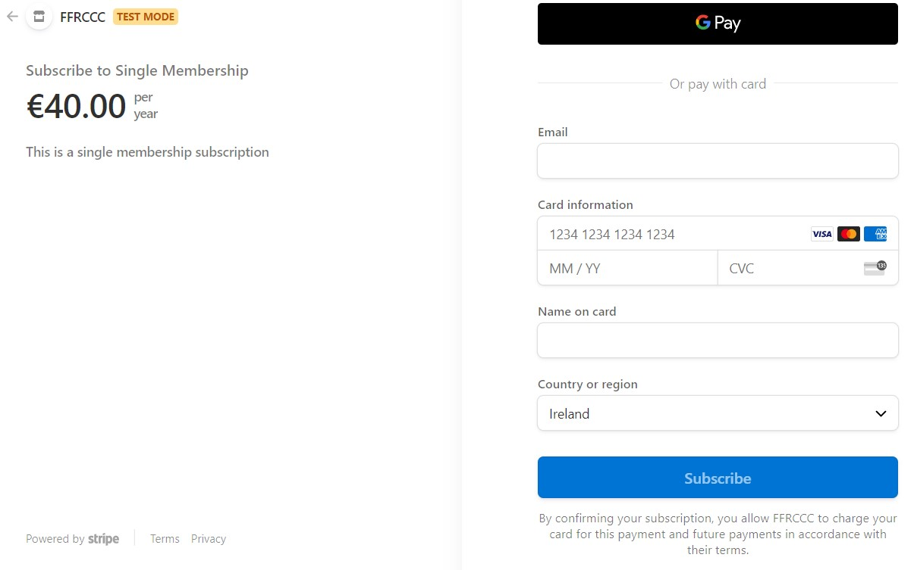

After successful payment, succeess page will show up.

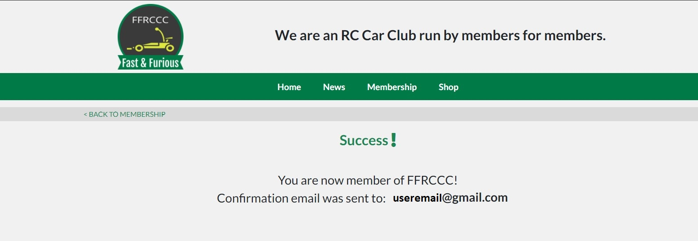

Now when the logged in user is also a member, card on membership page will display

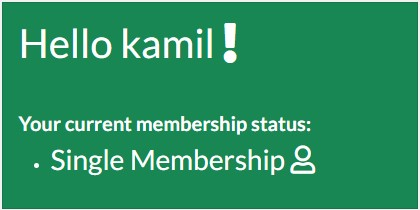

#### Shop

