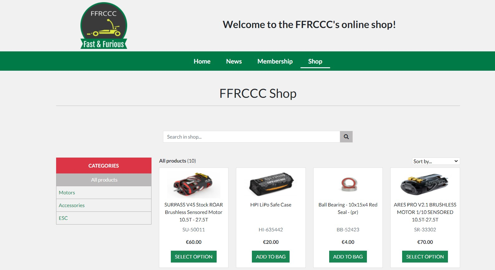
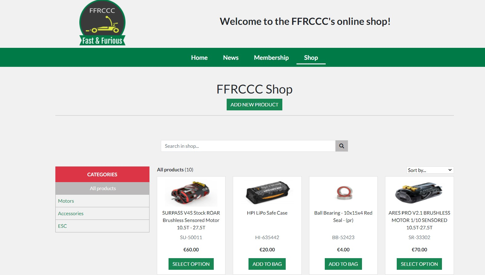
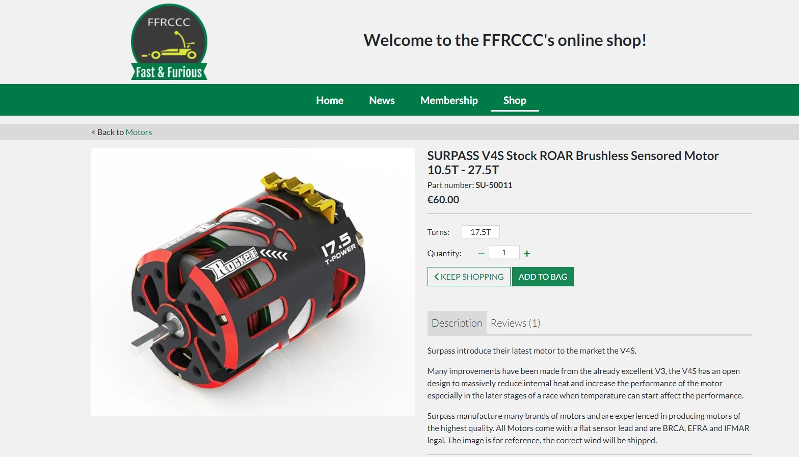
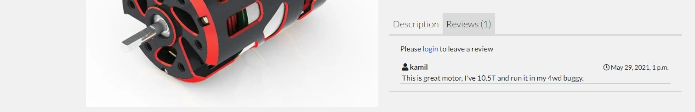
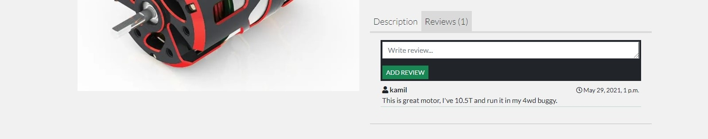
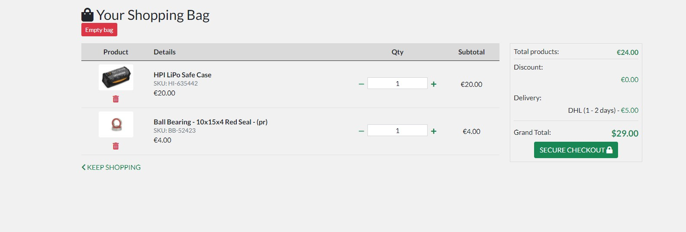
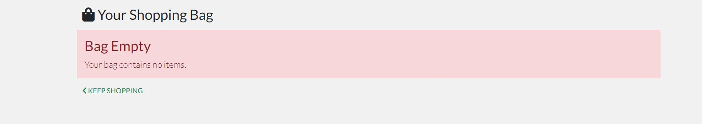
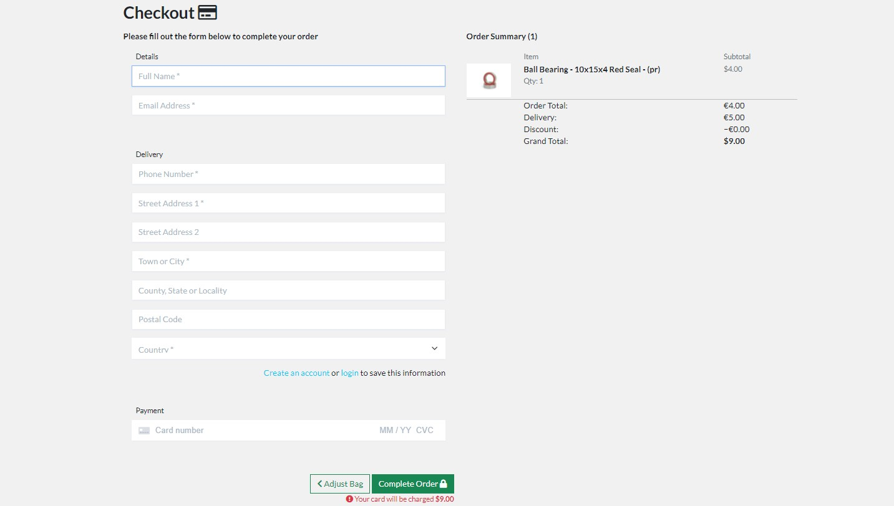
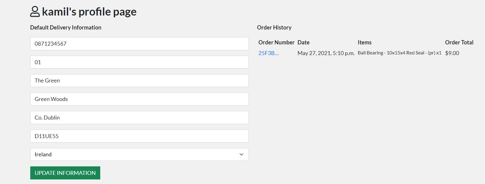
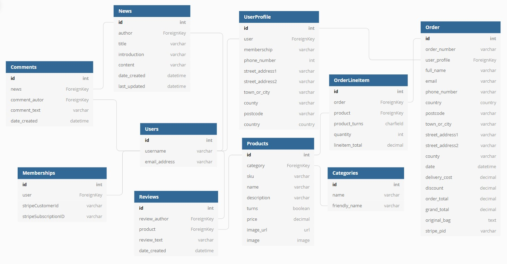

# Milestone Project 4

---

<p id="top"></p>

<p align="center">
    
</p>

## Fast & Furious RC Car Club

### 👉 [Heroku App](https://ffrccc-project.herokuapp.com/)

This Milestone project is a summary of learning and study from all modules of the Full Stack Developer Course, culminating in the creation of this Full Stack Framework Django project.

FFRCCC is a radio controlled car club. There are a number of users that the website will target and each of these user types will have a different need when using the website.

## Table of contents

- <a href="#project">Project Construction 👷</a>
- <a href="#ux">User Experience Design 🧠</a>
    - <a href="#us">User Stories</a>
    - <a href="#us">Design</a>
- <a href="#tech">Technologies Used 🔨</a>
  - <a href="#lang">Languages</a>
  - <a href="#flp">Frameworks, Libraries & Programs</a>
- <a href="#features">Features List 😲</a>
  - <a href="#existing">Existing Features</a>
  - <a href="#future">Future Features</a>
  - <a href="#defensive">Defensive Design</a>
- <a href="#databases">Databases 😲</a>
  - <a href="#dbchoice">Database Choice</a>
  - <a href="#dbmodeling">Data Modeling</a>
- <a href="#testing">Testing 🔥</a>
  - <a href="#manualtesting">Manual Testing</a>
  - <a href="#ustesting">User Stories</a>
  - <a href="#bugs">Bugs</a>
- <a href="#deployment">Deployment 🚀</a>
- <a href="#credits">Credits 🙏</a>
  - <a href="#code">Code</a>
  - <a href="#media">Media</a>
  - <a href="#ack">Acknowledgments</a>


<p id="project"></p>

## 1️⃣ Project Construction 👷

The application uses Django 3 which is one of the most popular development tools. The project uses Separation of Concern amongst the applications to utilise the Django Framework effectively.

In addition to using Django, sqlite was used in the early stages of the project as a test database for local testing. Sqlite is an independent, highly reliable SQL database engine that supports all normal relational database management functions. Before deployment, I switched to Postgres witch is open source software that provides a fully technical and easy-to-use object-oriented relational database management system.

Thanks to Django, the application administrator has full access to a completely custom admin dashboard where he can create, read, update and delete records in any proposed application model as needed.

For the testing of the store and subscriptions, a test credit card can be used by inputting the following details:
- Card Number: 4242 4242 4242 4242
- Exp date: 04/24
- CVC: 424
- ZIP: 42424

<div align="center"><p style="text-align: center"><a href="#top">Back to top ⬆️</a></p></div>

<p id="ux"></p>

## 2️⃣ User Experience Design 🧠

<p id="us"></p>

### User stories:

#### Guest (un-registered) User:

- As a Guest user, I want to view information about the club.
- As a Guest user, I want to see club contact informations.
- As a Guest user, I want to read the latest news about the club.
- As a Guest user, I want to read about benefits of membership.
- As a Guest user, I want to view all products in the shop.
- As a Guest User, I want to search for an item in the shop.
- As a Guest user, I want to sort prducts by price, name and category.
- As a Guest user, I want to see products within selected category.
- As a Guest User, I want to see product detailed view.
- As a Guest User, I want to be able to add items into the bag.
- As a Guest User, I want to be able to manipulate a bag content.
- As a Guest User, I want to see total count of the basket on every page.
- As a Guest User, I want to know how Grand Total was calculated.
- As a Guest User, I want easily fill out delivery information.
- As a Guest User, I want to view an order summary once a purchase is made.
- As a Guest User, I want to recieve an email confirmation when a purchase is made.
- As a Guest User, I want to be able to register for an account.
- As a Guest user, I want to be able to view the site on any device I may have.
- As a Guest user, I want app to be visually appealing and easy in use.

#### Registered User:

- As a Registered User, I want to have the ability to Login to the site via my registered details.
- As a Registered User, I want to be able to change my account password.
- As a Registered User, I want to be able to comment under individual club news.
- As a Registered User, I want to be able to purchase club membership.
- As a Registered User, I want to have a profile page where I can see and update my delivery details.
- As a Registered User, I want to have a profile page where I can see my purchase history.
- As a Registered User, I want to write a products reviews.


#### Superuser:

- As a Superuser, I want to add, edit and delete news.
- As a Superuser, I want to delete comments under individual news.
- As a Superuser, I want to add, edit and delete products in shop.
- As a Superuser, I want to delete products reviews.

#### Administrator:

- As an Administrator, I want to be able to login to an administration panel.

<p id="design"></p>

### Design:

#### Color Scheme:

The main three colors in the app:

-  #007A47 used as a background for navbar

-  #198754 bootstrap "success" color used to higlight text and for buttons

-  #1F2A34 used as footer background

#### Typography:

The "Lato" font is the main font used throughout the whole website with Sans Serif as the fall back font in case the font isn't imported into the site correctly.
Lato offers a pleasing reading ability to the user and is easy on the eyes. Font is  clean, professional and very readable amongst all major languages.

#### Content Structure:

The application is primarily rectangular shaped. Buttons, cards have sharp edges to create consistent view for the user. Content is grouped in sections, an example of this would be the Home page:
- The main body of the page is horizontally separated into sections, we have a hero section, about section where user can read  about the club, and finally we have membership section where are informations about membership. Page is finished by footer where user can find quick site links, club address, email address and social links.

#### Wireframes:

The first raw design wos drawn on a piece of paper and then the idea was transferred to an advanced creator.

##################################################################################################################

<div align="center"><p style="text-align: center"><a href="#top">Back to top ⬆️</a></p></div>

<p id="tech"></p>

## 3️⃣ Technologies Used 🔨

<p id="lang"></p>

### Languages Used:

- <a href="https://en.wikipedia.org/wiki/HTML" rel="noopener" target="_blank">HTML</a> - Standard mark-up language for documents designed to be displayed in a web browser.
- <a href="https://en.wikipedia.org/wiki/CSS" rel="noopener" target="_blank">CSS</a> - Describes how HTML elements are to be displayed on screen, paper, or in other media.
- <a href="https://en.wikipedia.org/wiki/JavaScript" rel="noopener" target="_blank">JavaScript</a> - Programming language that conforms to the ECMAScript specification.
- <a href="https://en.wikipedia.org/wiki/Python_(programming_language)" rel="noopener" target="_blank">Python</a> - Interpreted, high-level and general-purpose programming language

<p id="flp"></p>

### Frameworks, Libraries & Programs Used:

- <a href="https://getbootstrap.com/" rel="noopener" target="_blank">Bootstrap</a> - A modern responsive front-end framework based on Material Design.
- <a href="https://jquery.com/" rel="noopener" target="_blank">jQuery</a> - Fast, small, and feature-rich JavaScript library.
- <a href="https://git-scm.com/" rel="noopener" target="_blank">Git</a> - Free and open source distributed version control system.
- <a href="https://github.com/" rel="noopener" target="_blank">GitHub</a> - A Git repository hosting service.
- <a href="https://www.gitpod.io/" rel="noopener" target="_blank">GitPod</a> - Streamlines developer workflows by providing prebuilt, collaborative development environments in your browser - powered by VS Code.
- <a href="https://www.djangoproject.com/" rel="noopener" target="_blank">Django</a> - High-level Python Web framework that encourages rapid development and clean, pragmatic design.
- <a href="https://www.heroku.com/" rel="noopener" target="_blank">Heroku</a> - A cloud platform as a service supporting several programming languages.
- <a href="https://stripe.com/en-ie" rel="noopener" target="_blank">Stripe</a> - The company primarily offers payment processing software and application programming interfaces (APIs) for e-commerce websites and mobile applications.
- <a href="https://www.sqlite.org/index.html" rel="noopener" target="_blank">SQLite</a> - A C-language library that implements a small, fast, self-contained, high-reliability, full-featured, SQL database engine.
- <a href="https://www.postgresql.org/" rel="noopener" target="_blank">PostgreSQL</a> - Is a free and open-source relational database management system emphasizing extensibility and SQL compliance.
- <a href="https://aws.amazon.com/s3/" rel="noopener" target="_blank">Amazon S3</a> - Amazon Simple Storage Service (Amazon S3) is an object storage service that offers industry-leading scalability, data availability, security, and performance.
- <a href="https://fontawesome.com/" rel="noopener" target="_blank">Font Awesome</a> - A web font containing all the icons from the Twitter Bootstrap framework, and now many more.
- <a href="https://fonts.google.com/" rel="noopener" target="_blank">Google Fonts</a> - A library of 999 free licensed font families.
- <a href="balsamiq.com" rel="noopener" target="_blank">Balsamiq</a> - Wireframing tool.

<div align="center"><p style="text-align: center"><a href="#top">Back to top ⬆️</a></p></div>


<p id="features"></p>

## 4️⃣ Features List 😲

<p id="existing"></p>

### Existing features:

This application has different features for different user types. User status determines what kind of functions a given user has:
- Guest - unregistered / not logged in user.
- User - registered in database and logged in to application.
- Superuser - User with higher level of permissions. The Superuser can add, edit, delete news and shop products from the application level. He also ensures that comments and reviews does not break ethical rules.
- Admin - has the highest level of permissions and can login to admin panel.

#### Navigation:

The navbar serves as the main navigation for the site. It has bootstrap class="sticky" so it's always visible at the top of the page accross all pages of the site. The navbar has four links, which go to the home page, the news page, the the memberships page and shop.

The top header shows links to login and register and basket which is the link to the basket page and also to keep track of the ammount of the current basket.

Bottom header contains FFRCCC club logo, which links to the homepage.


- While user is logged in, instead of login and register links, he can see a 'My account' dropdown with options to go to the profile page or logout.


#### Footer:

The footer serves as secondary navigation. It has the same links as the navbar and also features the car club address and some external links to facebook, twitter and youtube.


#### Home:

The home page is the landing page upon sign-up and login and the main hub for the app. The main features on this site is the hero image and a statement in header to say to check the online shop.


Beneath all this there are about section where user can find info about club


and membership section where user can find membership info and redirection button to membership page.


#### News:

The news page serves as a place listing all of the news posts one page. The news are stacked in a single column vertically down the page on all screen sizes. Each news post shows the title, date of post, the author, the first 200 characters of introduction. By clicking on title user will be redirected to post view page.


- Superuser can also add, edit and delete a post from this page.


While adding post, Superuser can use HTML language to style post content.


#### Post view

The post page shows the full details of the individual news. On the top users can see handy web navigation to back to all news.


Underneath the post, there is an option to leave a comment about post.

- Guest users are limited to view the comments only.


- User will only be able to leave a comment if he is logged in.


- Superuser can delete any comment.


#### Membership

The memberships page serves as the page to buy club membership. First two paragraphs are to explain membership conditions. On the bottom of the page - membership card is displayed.


The content of membership card is dependent on the current membership of the user.

- Guest user will see membership card however 'Join' button will be disabled and 'You must login to purchase membership' text will be displayed.


- Logged in user will see card with active button.


Button click will take them to the stripe checkout page where they would add their card details and become member.


After successful payment, succeess page will show up.


- Now when the logged in user is also a member, card on membership page will display


#### Shop

The shop page lists all the products which are listed on the product database and some tools to help user navigate these products so he can find exactly what he want when there are a lot more items in the store.

1. Search bar which filters the results down by taking the search criteria and matching it to the product title, the product description. If nothing is entered into the search box when the user presses submits a search query, the page will a toast error message to let the user know he needs to enter search criteria to search the store.

2. Above the products on the left user can find a total count of the number of items currently listed on the page. If a category has been chosen, the count will show the category selected and the total number of ptoducts e.g "Accessories (4)". If the user has used the search box, instead total producs user will see e.g 'Search query: "motor"'.

3. Above the products on the right user can find a sort dropdown which lets the user sort by 6 different criteria - Price (high - low), price (low - high), name (a - z), name (z - a), category (a - z), category (z -a).

4. All the products are listed in individual cards which show the, title, SKU, price and 'add to bag' button if product has no options to select or 'select option' button if it does. Clicking the image or title will take the user to the product detail page. Clicking on the 'add to bag' button will automatically add product to bag.

5. On the left of the website user can select one of the category to filter products or see all products.



- Superuser can also add new add from this page.



#### Product details

The prduct detail page shows more information about a particular product. This has some of the same information seen on the product detail card in the store page, with some extra details. On the product detail page the user can see the product image, title, SKU, price, full description and reviews with number of reviews. On top of this, the user can update the quantity and select the options of the product to purchse, if the product has options. There is also a primary button here to add the product to the basket, and a secondary button to go back to the store. On the top of the page there is handy site nav where user can back to prouct category. This will take user back to the store, but the products will be filtered by that category.



- Guest users are limited to view the reviews only.



- User will only be able to leave a review if he is logged in.



- Superuser can delete any review.


#### Bag

The basket page shows a summary of the products in the basket and the amount that the current basket equates to. Here, the user has the ability to update the quantity of each product or delete it entirely from the basket, or drop the whole basket.
On the right side of the bag page, there is summary section that shows Total, Discount, Delivery and Grand Total. This way, user is able to check the order summary at first glance even if he has added a lot of products to the shopping cart.



If the user will enter the basket without products the information that bag is empty will show up.



#### Checkout

The checkout page has two sections, the delivery and personal information details and the total of the order. The details is a form when, if logged in, lets the user save their information to their profile for a quicker checkout next time. The order summary is similar to the basket page, and shows the breakdown of the amounts with the option ot edit the basket and a final summary of how much will be charged. The final feature on the page is the payment information which uses Stripe to handle the payments. A successfull payment will take the users to the order success page showing the order summary.



#### Profile

Logged in user have access to profile page. The profile page is split into two sections, delivery details and order history. The delivery details is a simple form and has an 'update information' button below to update their details on their profile, which would also reflect on the delivery details on the checkout page.

The order history shows a summary of the users previous orders. It is in the layout of a table and shows the order number, date, items and the grand total. Clicking the order number would take the user to the order summary where they would see a more detailed breakdown of the order.



<p id="future"></p>

### Future Features:

**Watch product:** I would like to implement a feature to save favorite products, so that users can have quick access to this products in profile.

#### Features left for implementation (features required by this release but they were not implemented due to time)
- Integration with Travis for CI/CD and unit-test.

<p id="defensive"></p>

### Defensive Design:

- If 404 and 500 error occured within the site, a page that has the message of the error and 'Back to Home' button so that the user would not be lost. The templates of 404.html and 500.html are added to the root template directory

- Django Form Validation

<div align="center"><p style="text-align: center"><a href="#top">Back to top ⬆️</a></p></div>


<p id="databases"></p>

## 5️⃣ Databasaes:

<p id="dbchoice"></p>

### Database Choice:

- Development phase SQLight database was used for the development which is installed with Django.

- Deployment phase PostgreSQL was used on deployment stage, which is provided as add-on by Heroku application.

- User model is provided as a default by [Django's authentication system](https://docs.djangoproject.com/en/3.1/ref/contrib/auth/).

<p id="dbmodeling"></p>

### Data Modeling:

Entity Relationship Diagram of this project:



<div align="center"><p style="text-align: center"><a href="#top">Back to top ⬆️</a></p></div>

<p id="testing"></p>

## 6️⃣ Testing 🔥

<p id="manualtesting"></p>

### Manual Testing:

Testing and improving the application was carried out throughout its development. The main testing tool was Google Chrome dev tools and devices such as phone, tablet and laptop with several versions of browsers (Google Chrome, Firefox, Edge, Opera).

Bootstrap5 framework was tested extensively to ensure application is mobile friendly. The Application was tested on my Lenovo Thinkbook laptop and large Samsung TV screen, Samsung Galaxy S6 mobile and Lenovo tablet. The application worked fine on all devices. If something didn't work as it should during the test it was immediately checked and corrected in DevTools and then implemented into the code and checked again. If test passed it was committed and pushed into repository.

Python based code was checked and tested using PEP8 online validator and finished without any errors.

JavaScript and jQuery were tested using JS Hint and finished without errors.

CSS was validated using W3C's Jigsaw Validator and finished without errors.

Passing the HTML file content through the W3C Validator for HTML resulted in numerous errors triggered by Jinja's framework embedded within the document. The standard HTML is W3C compliant, no other errors found.

<p id="ustesting"></p>

### User Stories:

Here are the steps and results from the testing carried based on the project user stories to determine that the app and functionality are fit for purpose:

#### Guest user:

1. As a Guest user, I want to view information about the club.
- Open <a href="https://ffrccc-project.herokuapp.com/">FFRCCC</a> app.
- On the home page scroll down to 'About Us' section.

Result: Informations about the club are very easy to find. Under the text user can find image from the club to illustrate how racings look like.

2. As a Guest user, I want to see club contact informations.
- From any page in application scroll down to footer.
- Footer provides address, email and phone contact informations. Redirections to social media are also provided.

Result: Informations in footer are displayed correctly, all links are working. Email and social media are currently the fastest ways to contact any club.

3. As a Guest user, I want to read the latest news about the club.
- From any page in application locate and click 'News' link on navbar.
- On news page scroll down to see all news.
- Click on the title to see particular post.

Reslut: All news are displayed as they should. News are displayed from newset to oldest. Click on the news title will open detailed post view.

4. As a Guest user, I want to read about benefits of membership.
- Option 1:
    - From any page in application locate and click 'Membership' link on navbar.
    - On membership page scroll down to see informations about membership.
- Option 2:
    - On the home page scroll down to membership section.
    - Click 'BECOME A MEMBER' button.
    - On membership page scroll down to see informations about membership.

Result: Both methods redirect user to membership page. On membership page user can find informations and benefits of membership. However guest user won't be able to purchase membership. 'JOIN NOW' button will be disabled.

5. As a Guest user, I want to view all products in the shop.
- From any page in application locate and click 'Shop' link on navbar.
- On shop page scroll down to see displayed ads.

Result: Everything is displayed as it should. Main shop page is displaying all ads. The number of products correctly shows the correct number shown on the page.

6. As a Guest User, I want to search for an item in the shop.
- From any page in application locate and click 'Shop' link on navbar.
- On the shop locate search bar.
- Type the product you are looking for and click on search icon.

Result: Search option works as it should. When user searches for a product the results are filtered correctly based on the input and showing results compared against the title and description. Over the ads user will see search query he typed. 

7. As a Guest user, I want to sort prducts by price, name and category.
- From any page in application locate and click 'Shop' link on navbar.
- Over the ads on the right side sort selector is located.
- Click on selector and select sort method.

Result: Sort option works as it should. User can sort produts by price, name and category. Sorting also works when sorting while filtering by search query a specific category.

8. As a Guest user, I want to see products within selected category.
- From any page in application locate and click 'Shop' link on navbar.
- On the shop page on the left side are displayed categories.
- Click on the category you want to browse.

Result: Category selection works as it should. The arrow indicate which category user is browsing. Over the ads user can see current category and number of products.

9. As a Guest User, I want to see product detailed view.
- From any page in application locate and click 'Shop' link on navbar.
- Scroll down and choose product you want to see.
- Click on the image or product title.

Result: Everything works as it should. Products in shop are displayed on cards and display: Image, title, SKU, price and action button. Clicking on image or title will redirect user to detailed view. User will see big image, description and reviews. However only logged in user will be able to add product reviews. 'KEEP SHOPPING' button will redirect user to shop main page. User can also select to browse product category from the handy page navigation.

10. As a Guest User, I want to be able to add items into the bag.
- From any page in application locate and click 'Shop' link on navbar.
- Scroll down to find product you want to add to bag.
- Option 1:
    - Click on 'Add to bag' button on products card.
- Option 2:
    - Click on image or title to see detailed product view.
    - In detailed product view click 'add to bag' button.

Result: Adding items into the bag is working as it should. Success toast message confirms adding action. The price on the top header will automatically update. Products with 'sellect option' will require to select correct option before adding.

11. As a Guest User, I want to be able to manipulate a bag content.
- From any page in application locate and click 'bag' link located on the top header.
- If bag contains no products you will see info 'Bag Empty'.
- If bag contains products you will see your products and options to adjust them:
    - Under the product image you will see 'bin' icon to completely remove product from your basket regardless of the quantity.
    - In QTY tab you can manualy increase or decrease product quantity.
    - 'Empty bag' button will remove all products deom bag.

Result: Adjusting products in bag works as it should. Product QTY input will allow user to manually insert any quantity he likes, however if he input quantity lower or equal 0, the product will be removed from the bag. Each quantity modification requires to update the bag. Update bag link will show up evey time the QTY was adjusted.

12. As a Guest User, I want to see total count of the basket on every page.
- After adding the product to bag, the price on the top header will be updated.
- Click home link on navbar and on the home page check the price on the top of header.
- Click news link on navbar and on the news page check the price on the top of header.
- Click any news to go to post view and check the price on the top of header.
- Click membership link on navbar and on the membership page check the price on the top of header.

Result: Grand total price is displayed on every page across the app. This is thanks to contexts.py file in the bag app. 

13. As a Guest User, I want to know how Grand Total was calculated.
- From any page in application locate and click 'bag' link located on the top header.
- If bag contains products you will see your products and on the right side Grand Total summary.
- This will show:
    - Total products - this is calculation of products total.
    - Discount - this is shopping doscount.
    - Delivery - this is delivery cost.
    - Grand Total - this is summary of three above.

Result: Grand Total calculation works as expected and is presented in very clear way. Guest users are not entiled to any discount and delivery cost for them is always &euro;5.

14. As a Guest User, I want easily fill out delivery information.
- From any page in application locate and click 'Shop' link on navbar.
- Add products to bag through 'ADD TO BAG' button on product card or 'ADD TO BAG' button in product detail page.
- Click on 'bag' link located on the top header.
- On the 'bag' page click 'SECURE CHECKOUT' button.
- On the 'checkout' page you will see 'Please fill out the form below to complete your order'.
- Fil out Details, Delivery and Payment forms.

Result: Filling out form works as expected. All form fields load correctly. Under delivery form the promt to login or create an account is visible. Form validation for mandatory fields works as expected. Filling the card information field with invalid information will prompt a validation error from stripe.

15. As a Guest User, I want to view an order summary once a purchase is made.
- From any page in application locate and click 'Shop' link on navbar.
- Add products to bag through 'ADD TO BAG' button on product card or 'ADD TO BAG' button in product detail page.
- Click on 'bag' link located on the top header.
- On the 'bag' page click 'SECURE CHECKOUT' button.
- On the 'checkout' page you will see required forms to fill out and 'order summary section' on right.
- Fill out Details, Delivery and Payment forms.
- Click 'Complete Order' button.
- 'Success' page which will show a summary of the order.

Result: Order summary works as expected. Once confirmation from stripe has come through, the user is taken to a success page which will show a summary of the order.

16. As a Guest User, I want to be able to register for an account.
- From any page in application locate and click 'Register' link on top header.
- On 'Registration' page fill out Sign Up form and click 'SIGN UP' button.
- On 'Confirm Email' page you will be informed that confirmation email was sent to your email provided.
- Click confirmation link you've got from ffrcclub@gmail.com.
- You'll be transfered on another confirmation page where you have to click 'CONFIRM' button once email address and username are correct.
- You'll be redirected to login page where you can login using your registered details.

Result: Registration works as it should. This is very robust system thanks to allauth. During registration it is validating database for existing email or username. It is also validating password if it is not same as username or to common.

17. As a Guest user, I want to be able to view the site on any device I may have.
- On device you prefer open <a href="https://ffrccc-project.herokuapp.com/">FFRCCC</a> app.
- On 'Home' page scroll down to footer and click 'News' link.
- On 'News' page click one of the articles.
- On 'Post view' page scroll down to footer and click 'Membersgip' link.
- On 'Membership' page scroll down to footer and click 'Shop' link.
- On 'Shop' page choose one product card and click on it's image or title.
- On 'Product view' page scroll down and click 'ADD TO BAG' button.
- Click on 'Bag' link on page header on navbar if on medium or smaller devices.
- On 'Bag' page click 'SECURE CHECKOUT' button.
- On 'Checkout' page fill out forms and click 'COMPLETE ORDER' button.
- On 'Checkout success' page click Home in navbar or use hamburger menu to find home link and clik.

Result: Responsivnes of the app works as expected. App works great on small, medium and large devicess. This is thanks to using Bootstrap5 and extesivly using Google Dev Tools to check responsivnes during app developing.

18. As a Guest user, I want app to be visually appealing and easy in use.
- On device you prefer open <a href="https://ffrccc-project.herokuapp.com/">FFRCCC</a> app.
- On 'Home' page scroll down to footer and click 'News' link.
- On 'News' page click one of the articles.
- On 'Post view' page scroll down to footer and click 'Membersgip' link.
- On 'Membership' page scroll down to footer and click 'Shop' link.
- On 'Shop' page choose one product card and click on it's image or title.
- On 'Product view' page scroll down and click 'ADD TO BAG' button.
- Click on 'Bag' link on page header on navbar if on medium or smaller devices.
- On 'Bag' page click 'SECURE CHECKOUT' button.
- On 'Checkout' page fill out forms and click 'COMPLETE ORDER' button.
- On 'Checkout success' page click Home in navbar or use hamburger menu to find home link and clik.

Result: Using application is very easy. User can always locate himself thanks to intelligent page navigation. Colors 'catch' user eye and page layout is user friendly.

#### Registered User:

1. As a Registered User, I want to have the ability to Login to the site via my registered details.
- From any page in application locate and click 'Log In' link on top header.
- On 'Log In' page fill out form with details you provided on registration and click 'Log In' button.

Result: Log In functionality works as it should. This is thanks to allauth. Once user provide correct informations he will be logged in to the app. Form validation is provided by allauth.

2. As a Registered User, I want to be able to change my account password.
- From any page in application locate and click 'Log In' link on top header.
- On 'Log In' page click 'Forgot Password?' link.
- On 'Password reset' page input email you provided on registration and click 'Reset Passwrod' button.
- On another page you will be informed that password reset link was sent on your email account.
- Click on the reset password link you've got from ffrcclub@gmail.com
- On 'Change password' page input your new password and click 'Change Password' button.
- 'Change password confirmation' page will show up and now you'll be able to login using new password.

Result: Password change functionality works as it should. This is thanks to allauth.

3. As a Registered User, I want to be able to comment under individual club news.
- From any page in application locate and click 'News' link on navbar.
- On 'News' page click on the post you want to comment.
- Scroll down to comment section.
- Write a comment in provided input and click 'ADD COMMENT' button.

Result: Adding comment works as it should. The comment counter increse with every comment. Newest comments are on the top. Each comment shows author and date created.

4. As a Registered User, I want to be able to purchase club membership.
- From any page in application locate and click 'Membership' link on navbar.
- On 'Membership' page scroll down to membership card and click 'JOIN NOW' button.
- You'll be redirected to Stripe checkout session.
- Fill out Stripe form.
- Once payment is confirmed you'll be redirected to success page.
- Once Stripe webhook checkout succeed will succeed you'll get email confirmation.
- From success page click 'BACK TO MEMBERSHIP' page or click 'Membership' link on navbar.
- On 'Membership' page scroll down to membership card where you'll be able to see that you are a club member.

Result: Membership functionality works as it should. Once the checkout succeed webhook is confirmed, new Stripe Customer will be created in database with username, stripe subscription ID and stripe customer ID and confirmation email will be send. It will also set membership to 'active' in user profile. 'Membership' page is comunicating with Stripe to check if subscription status is 'active'.

5. As a Registered User, I want to have a profile page where I can see and update my delivery details.
- From any page in application locate and click 'My account' dropdown on navbar.
- Once dropdown menu expands, click 'My Profile'
- On 'My Profile' page you'll see 'Default Delivery Information' section with form.
- Fill out form and click 'UPDATE INFORMATION' button.

Result: Everything works as it should. If the user has profile information saved, these fields will be pre populated. If the user has not saved profile information previously, the fields appear with their placeholders.

6. As a Registered User, I want to have a profile page where I can see my purchase history.
- From any page in application locate and click 'My account' dropdown on navbar.
- Once dropdown menu expands, click 'My Profile'
- On 'My Profile' page you'll see 'Order History' section.

Result: Everything works as it should. 'Order History' section provides table with: Order Number, Date, Items, Order Total. Clicking on the order number takes the user to the 'Order History' page with the informations from 'Checkout success' page.

7. As a Registered User, I want to write a products reviews.
- From any page in application locate and click 'Shop' link on navbar.
- On 'Shop' page choose product you want to review.
- Click image or title to go to 'Product detail' page.
- On 'Product detail' page find and click 'Review' tab.
- Writr a review and click 'ADD REVIEW' button.

Result: Adding reviews works as it should. The reviews counter increse with every review. Newest review are on the top. Each review shows author and date created.

#### Superuser

1. As a Superuser, I want to add, edit and delete news.
- From any page in application locate and click 'News' link on navbar.
- Adding post: 
    - On 'News' page under the main header click on 'ADD NEW POST' button.
    - On 'Add new post' page fill out form and click 'ADD POST' button.
    - You will be redirected to 'Post detail' page.
- Edit post:
    - On 'News' page locate post you want edit and click on title.
    - On 'Post detail' page Click 'Edit' link
    - On 'Edit' page update prepopulated form and click 'EDIT POST' button.
    - You will be redirected to 'Post detail' page.
- Delete product:
    - On 'News' page locate post you want edit and click on title.
    - On 'Post detail' page Click 'Delete' link
    - You will be redirected to 'News' page.

Result: All CRUD functionality works as it should. All forms are visible. While adding new post, superuser can use HTML language to style post content. After add, new post will be stored in database.

2. As a Superuser, I want to delete comments under individual news.
- From any page in application locate and click 'News' link on navbar.
- Click on post title you want to delete a comment.
- Scroll down to comments section.
- Each comment will have 'Delete' link on the bottom.
- Click 'Delete'.

Result: Comment delete functionality works as it should. The comment counter decrease with every deleted comment. Superuser can delete any individual comment. After delete is successful he will be redirected to the same post page.

3. As a Superuser, I want to add, edit and delete products in shop.
- From any page in application locate and click 'Shop' link on navbar.
- Adding product: 
    - On 'Shop' page under the main header click on 'ADD NEW PRODUCT' button.
    - On 'Add new post' page fill out form and click 'ADD POST' button.
    - You will be redirected to 'Product detail' page.
- Edit product:
    - On 'Shop' page locate product you want edit and click on image or title.
    - On 'Product detail' page Click 'Edit' link
    - On 'Edit' page update prepopulated form and click 'EDIT PRODUCT' button.
    - You will be redirected to 'Product detail' page.
- Delete product:
    - On 'Shop' page locate product you want edit and click on image or title.
    - On 'Product detail' page Click 'Delete' link
    - You will be redirected to 'Shop' page.

Result: All CRUD functionality works as it should. All forms are visible. While adding new product, superuser can use HTML language to style post dscription. After add, new product will be stored in database.

4. As a Superuser, I want to delete products reviews.
- From any page in application locate and click 'Shop' link on navbar.
- Locate product card you want to delete review.
- Click on product image or title to go to 'Product detail'.
- Click review tab.
- Each review will have 'Delete' link on the bottom.
- Click 'Delete'.

Result: Review delete functionality works as it should. The reviews counter decrease with every deleted review. Superuser can delete any individual review. After delete is successful he will be redirected to the same product page.

#### Administrator:

1. As an Administrator, I want to be able to login to an administration panel.
- From home page in application in URL bar add /admin/ and press Enter.
- Login using your username and password.

Result: All works ass expected. Django administration panel is working fine.

 <div align="center"><p style="text-align: center"><a href="#top">Back to top ⬆️</a></p></div>

 <p id="deployment"></p>

## 7️⃣ Deployment 🚀

This project was developed in GitPod and deployed to Heroku for production.

### Deploying to Heroku

In order to deploy to heroku I:

1. In Heroku I created a new app. I clicked on 'NEW' button and from dropdown menu I selected 'Create New App'. I set app name and chose region closest to me.
2. Once the app was created I went to Resources tab and in Add-ons search bar I typed Postgress and selected Heroku Postgres. I selected Hobby Dev - Free and added it to my project.
3. Next I went to Settings tab and from Reveal Config Vars I copied:
- DATABASE_URL Key.
4. I set DATABASE_URL in env.py
5. To be able to deploy my Django project to Heroku I installed in gitpod required packages:
- gunicorn
- psycopg2-binary
- dj-database-url
6. From the command line in gitpod I have created a requirements.txt file with the following command:
```
pip3 freeze > requirements.txt
```
7. From the command line in gitpod I have created the Procfile with the following command:
```
echo web: gunicorn rc_club.wsgi:application > Procfile
```
8. In settings.py file I imported dj_database_url
9. In settings.py file I updated default database:
```
if 'DATABASE_URL' in os.environ:
    DATABASES = {
        'default': dj_database_url.parse(os.environ.get('DATABASE_URL'))
    }
else:
    DATABASES = {
        'default': {
            'ENGINE': 'django.db.backends.sqlite3',
            'NAME': os.path.join(BASE_DIR, 'db.sqlite3'),
        }
    }
```
10. From the command line in GitPod I migrated the database models to Posgres:
```
python3 manage.py migrate
```
11. From the command line in GitPod I created superuser for Postgres:
```
python3 manage.py createsuperuser
```
12. From the command line in GitPod I logged in to Heroku:
```
heroku login -i
```
13. From the command line in GitPod I temporarily disable collect static files:
```
heroku config:set DISABLE_COLLECTSTATIC=1
```
14. In setting.py I updated Allowed Hosts:
```
ALLOWED_HOSTS = ['ffrccc-project.herokuapp.com', 'localhost']
```
15. Finally I pushed evrything to my GitHub:
```
git add .
git commit -m
git push
```
16. To deploy to heroku I initialize my heroku git remote by typing in GitPod command line:
```
heroku git:remote -a ffrccc-project
```
17. Then pushed by typing command:
```
git push heroku master
```
18. After this I checked my Heroku, clicked on 'Open App' button and my app was successfully deployed but without static files yet.
19. Once in Heroku, in 'Deploy' tab I connected app to GitHub to enabled automatic deploys.
20. In Settings tab in Config Variables I set SECRET_KEY
21. In setting.py I changed DEBUG settings:
```
DEBUG = 'DEVELOPMENT' in os.environ
```
22. The static files and media files for this deployed site (e.g. products images) are hosted in the AWS S3 Bucket. In order to upload files I created:
- AWS account.
- Bucket Policy
- Group
- Access Policy
- User

23. To connect Django to S3 bucket I installed two new packages using GitPod command line:
```
pip3 install boto3
```
```
pip3 install django storages
```
24. I freeze installed packages to requirements.txt.
25. I added 'storages' into INSTALLED_APPS in settings.py
26. I added following into settings.py:
```
if 'USE_AWS' in os.environ:
    # Cache control
    AWS_S3_OBJECT_PARAMETERS = {
        'Expires': 'Thu, 31 Dec 2099 20:00:00 GMT',
        'CacheControl': 'max-age=94608000',
    }

    # Bucket Config
    AWS_STORAGE_BUCKET_NAME = 'ffrccc-project'
    AWS_S3_REGION_NAME = 'eu-west-1'
    AWS_ACCESS_KEY_ID = os.environ.get('AWS_ACCESS_KEY_ID')
    AWS_SECRET_ACCESS_KEY = os.environ.get('AWS_SECRET_ACCESS_KEY')
    AWS_S3_CUSTOM_DOMAIN = f'{AWS_STORAGE_BUCKET_NAME}.s3.amazonaws.com'

    # Static and media files
    STATICFILES_STORAGE = 'custom_storages.StaticStorage'
    STATICFILES_LOCATION = 'static'
    DEFAULT_FILE_STORAGE = 'custom_storages.MediaStorage'
    MEDIAFILES_LOCATION = 'media'

    # Override static and media URLs in production
    STATIC_URL = f'https://{AWS_S3_CUSTOM_DOMAIN}/{STATICFILES_LOCATION}/'
    MEDIA_URL = f'https://{AWS_S3_CUSTOM_DOMAIN}/{MEDIAFILES_LOCATION}/'
```
27. I added <a href="custom_storages.py">custom_storages.py</a> file.
28. Next in Heroku in Settings tab in Reveal Config Vars I added my AWS environmental variables:
- AWS_ACCESS_KEY_ID
- AWS_SECRET_ACCESS_KEY
- USE_AWS = True
29. From the same location I removed DISABLE_COLLECTSTATIC variable as it was not longer needed.
30. In GitPod I pushed all changes to GitHub and automatically to Heroku.
31. After this I checked my Heroku, clicked on 'Open App' button and my app was successfully deployed including static files.
32. In order to send real emails from the application, you need to connect it to your Gmail account, setting up your email address in EMAIL_HOST_USER variable and your app password generated by your email provider in EMAIL_HOST_PASS variable.
33. Next in Heroku in Settings tab in Reveal Config Vars I added my AWS environmental variables:
- EMAIL_HOST_PASS
- EMAIL_HOST_USER
34. Finally I added Stripe to the rest of Heroku Config Variables in Settings tab:
- STRIPE_MEMBERSHIP_WH_SECRET
- STRIPE_PRICE_ID
- STRIPE_PUBLIC_KEY
- STRIPE_SECRET_KEY
- STRIPE_WH_SECRET

### Local Deployment

To be able to run this project, the following tools have to be installed:

- An IDE of your choice (I used GitPod for creating this project)
- Git
- PIP
- Python3

Apart from that, you also need to create accounts with the following services:
- Stripe
- AWS to setup the S3 basket
- Gmail

1. You can clone this repository directly into the editor of your choice by pasting the following command into the terminal:
```
git clone https://github.com/zokam1411/milestone-project-4
```
Alternatively, you can save a copy of this repository by clicking the Code button and select Download ZIP and after extract the zip file to your folder.

In the terminal window of your local IDE change the directory (CD) to the correct file location (directory that you have just created).

2. Set up environment variables.

Note, that this process will be different depending on IDE you use.

In this it was done using the following way:

- Create .env file in the root directory.
- Add .env to the .gitignore file in your project's root directory
- In .env file set environment variables with the following syntax:
```
import os  
os.environ["DEVELOPMENT"] = "True"    
os.environ["SECRET_KEY"] = "<Your SECRET_KEY>"    
os.environ["STRIPE_PUBLIC_KEY"] = "<Your STRIPE_PUBLIC_KEY>"    
os.environ["STRIPE_SECRET_KEY"] = "<Your STRIPE_SECRET_KEY>"    
os.environ["STRIPE_WH_SECRET"] = "<Your STRIPE_WH_SECRET">"
os.environ["STRIPE_PRICE_ID"] = "<Your STRIPE_PRICE_ID>"
os.environ["STRIPE_MEMBERSHIP_WH_SECRET"] = "<STRIPE_MEMBERSHIP_WH_SECRET>"
os.environ["DOMAIN_URL"] = "<Your DOMAIN_URL>/membership/"
```     

3. Install all requirements from the requirements.txt file putting this command into your terminal:
```
pip3 install -r requirements.txt
```
4. In the terminal in your IDE migrate the models to crete a database using the following commands:
```
python3 manage.py migrate
```
5. Create a superuser to have an access to the the admin panel(you need to follow the instructions then and insert username,email and password):
```
python3 manage.py createsuperuser
```
6. You will now be able to run the application using the following command:
```
python3 manage.py runserver
```
7. To access the admin panel, you can add the /admin path at the end of the url link and login using your superuser credentials.

<div align="center"><p style="text-align: center"><a href="#top">Back to top ⬆️</a></p></div>

<p id="credits"></p>

## 8️⃣ Credits 🙏

<p id="code"></p>

- The project's code was developed by following the Code Institute video lessons and based on the understanding of the Boutique Ado Django Mini-Project, but was customized, modified and enhanced to fit the project purposes.

- <a href = "https://testdriven.io/blog/django-stripe-subscriptions/">Stripe Subscription Payment Options</a> I used this tutorial to understeand how to setup Stripe subscription.

- <a href = "https://www.askpython.com/django/django-blog-app">Django Blog App – Add Bloging and Commenting to Your Django App</a> I used this tutorial to understeand how to add comments to post.

<p id="media"></p>

### Media:

- All the icons in this website were provided by [Font Awesome](https://fontawesome.com/).
- Favicon was made by [favicon.io](https://favicon.io/).
- Logo was made by [FreeLogoDesign](https://www.freelogodesign.org/)
- Hero and club images - Lee McGuire - Secretary in [Dublin Model Car Club](http://www.dublinmodelracing.com/contact.html)

<p id="ack"></p>

### Acknowledgments:

- <a href="https://codeinstitute.net" rel="noopener" target="_blank">Code Institute</a>
- <a href="https://stackoverflow.com/" rel="noopener" target="_blank">Stack Overflow</a>
- Code Institute Slack Community.
- My mentor Guido Cecilio for guidance and support.
- My family and friends for their patience and honest critique throughout.

<div align="center"><p style="text-align: center"><a href="#top">Back to top ⬆️</a></p></div>